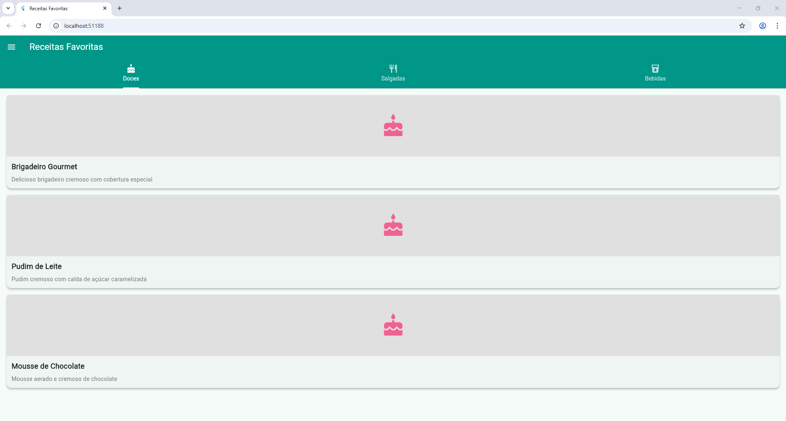

# 🍽️ Receitas Favoritas

Um aplicativo Flutter intuitivo para explorar e descobrir receitas deliciosas organizadas por categorias.

## 📱 Funcionalidades

- **Navegação por Abas**: Explore receitas organizadas em três categorias principais:
  - 🧁 **Doces**: Sobremesas e doces irresistíveis
  - 🍝 **Salgadas**: Pratos principais e petiscos
  - 🥤 **Bebidas**: Drinks e bebidas refrescantes

- **Cards Interativos**: Cada receita é apresentada em um card elegante com:
  - Título da receita
  - Descrição breve
  - Ícone representativo da categoria

- **Detalhes Completos**: Ao tocar em uma receita, acesse:
  - Título e descrição detalhada
  - Lista completa de ingredientes
  - Modo de preparo passo a passo

- **Menu Lateral (Drawer)**: Acesso rápido a:
  - ⚙️ Configurações do app
  - ℹ️ Informações sobre o aplicativo

## 🏗️ Estrutura do Projeto

```
lib/
├── main.dart                    # Ponto de entrada do app
├── models/
│   └── receita.dart            # Modelo de dados da receita
├── data/
│   └── receitas_data.dart      # Dados mockados das receitas
├── screens/
│   ├── home_screen.dart        # Tela principal com abas
│   ├── detalhes_receita_screen.dart  # Tela de detalhes
│   ├── configuracoes_screen.dart     # Tela de configurações
│   └── sobre_screen.dart       # Tela sobre o app
└── widgets/
    └── receita_card.dart       # Widget do card da receita
```

## 🎨 Design e UX
Versão 1 do sistema


## 🚀 Como Executar

1. **Pré-requisitos**:
   - Flutter SDK instalado
   - Dart SDK
   - Emulador ou dispositivo físico
# 🍽️ Receitas Favoritas

Aplicativo Flutter para navegar, adicionar e gerenciar receitas organizadas por categorias (Doces, Salgadas e Bebidas). O projeto é intencionalmente simples e serve como base para experimentar UI/UX, CRUD local e autenticação básica.

## Principais recursos

- Navegação por abas (Doces, Salgadas, Bebidas)
- Cards com visual das receitas e acesso à tela de detalhes
- CRUD: adicionar, editar e remover receitas (com desfazer)
- Autenticação simples (login / cadastro) em memória
- Suporte para imagens locais em `assets/images/`

## Estrutura resumida

```
lib/
├─ main.dart
├─ models/ (modelos de dados)
├─ data/ (dados de exemplo)
├─ providers/ (state management via Provider)
├─ screens/ (telas do app)
└─ widgets/ (componentes reutilizáveis)
```

## Como executar

1. Certifique-se que o Flutter está instalado.
2. No terminal, a partir da raiz do projeto:

```bash
cd "c:\Users\jhenn\OneDrive\Documentos\App de Receitas Favoritas\receitas_favoritas"
flutter pub get
flutter run -d chrome
```

Observação: este projeto usa imagens locais em `assets/images/`. Adicione `assets/images/receitas.jpeg` (ou outras imagens) para o visual das telas de login/cadastro.

## Testes

```bash
flutter test
```

## Notas de desenvolvimento

- Persistência: atualmente os dados (receitas e usuários) são armazenados em memória através de providers. Para manter dados entre reinicializações, é recomendada a integração com SQLite, Hive ou um backend.
- Autenticação: apenas demonstrativa/local; para produção use backend e armazenamento seguro de senhas.

## Contribuições

Fique à vontade para abrir PRs com melhorias: seleção de imagens, persistência, integração com API, temas e testes adicionais.

---

Desenvolvido com ❤️ — se quiser, eu implemento melhorias visuais (mostrar senha, animações) ou adiciono um seletor de imagem para o fundo.
